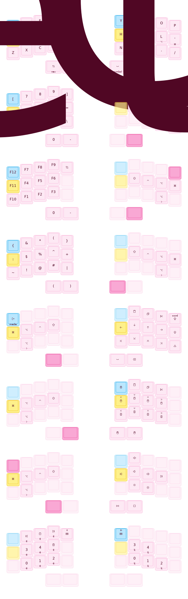
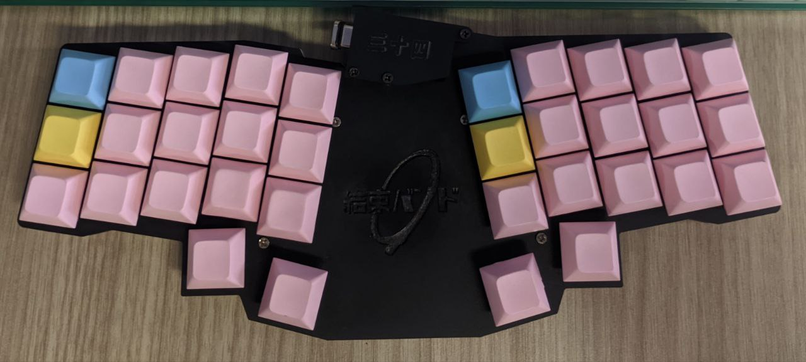

# ZMK Config

This is my personal ZMK config for my keyboard, Reviung41. Although, I modified it such that it only has
34 keys instead of 41. At some point I want to make some adjustment for the PCB but for the time being
it's just a Reviung41 without the keys in the middle.
It's not 100% ideal since the position of the keys are not perfect, but it's good enough for me.

The keyboard is using [joric/nrfmicro](https://github.com/joric/nrfmicro) as the controller and it's using [zmkfirmware/zmk](https://github.com/zmkfirmware/zmk) as the firmware because I want to use it wirelessly.

The keymap can be seen here (generated using [caksoylar/keymap-drawer](https://github.com/caksoylar/keymap-drawer/tree/main)):

The actual picture of the keyboard:

